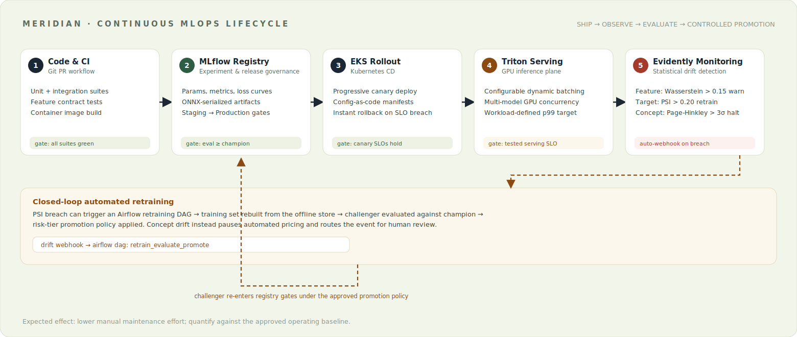
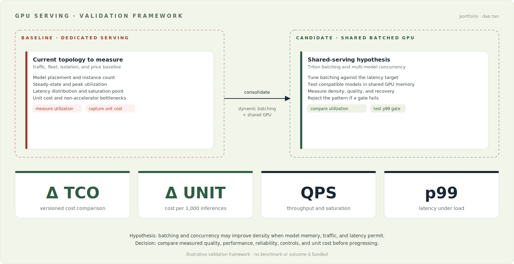
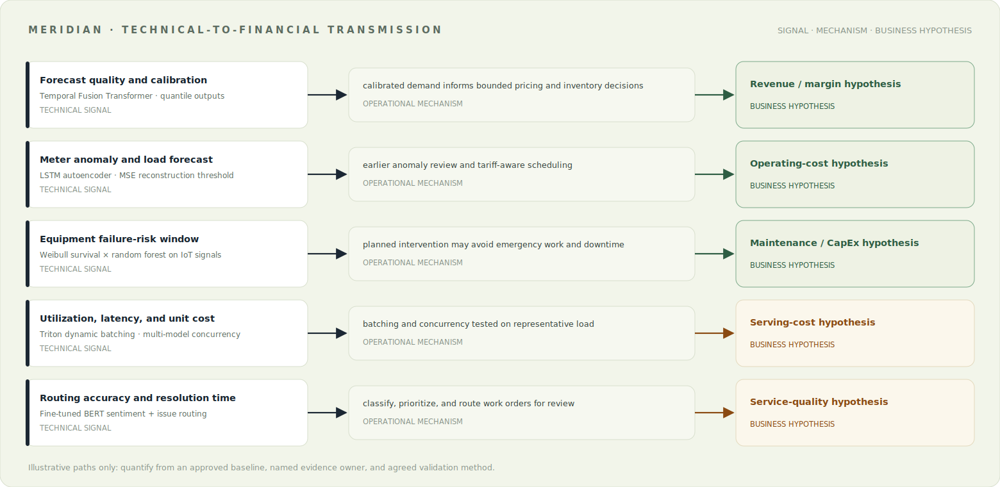

# Enterprise MLOps Platform: MERIDIAN Reference Blueprint

[Architecture](docs/architecture.md) · [Model portfolio](docs/model-portfolio.md) · [Business-impact assumptions](docs/business-impact.md) · [GPU serving PoC](docs/poc-playbook.md)

## Overview

MERIDIAN is a sanitized architecture blueprint for operating multiple machine-learning workloads on a shared data, feature, training, serving, and monitoring platform.

The project covers eight model families across demand forecasting, constrained reinforcement-learning pricing, anomaly detection, predictive maintenance, asset clustering, feasibility analysis, and NLP ticket routing. The public repository retains representative interfaces, configuration shapes, model skeletons, deployment manifests, diagrams, and operational controls while excluding proprietary logic and production data.

## Portfolio Role

This is the technical-foundation layer of the [Enterprise AI Infrastructure Portfolio](https://github.com/daetan999/technical_resume). It demonstrates how workload behavior, feature contracts, model governance, GPU serving, reliability controls, and unit economics inform credible infrastructure discovery before commercial sizing begins.

## Published Artifact Status

This repository is a **sanitized reference blueprint**, not a deployable copy of a production platform.

| Available here | Deliberately excluded |
|---|---|
| Representative model and feature contracts | Proprietary transformations and training data |
| Airflow DAG and drift-response shapes | Live orchestration connections and credentials |
| Triton and Kubernetes serving configuration | Registry images, clusters, and runtime endpoints |
| Architecture, controls, and PoC acceptance criteria | A production-ready environment or end-to-end demo |

Claims below describe the documented architecture, example controls, and illustrative value hypotheses. They do not imply that the public tree can reproduce a private deployment or any performance outcome.

## Public-Portfolio Boundary

- Client names, property identifiers, datasets, endpoints, credentials, and internal codenames are removed or replaced.
- Code is illustrative where production implementation cannot be published.
- Business-impact examples are hypotheses that require a measured baseline and customer validation.
- Architecture and control patterns are retained to show the design decisions behind the system.

## Platform Architecture


The platform is organized around a common operating path:

1. Kafka and Airflow ingest operational, telemetry, and external signals.
2. Feast provides Redis-backed online features and Snowflake point-in-time training data.
3. PyTorch training jobs register evaluated artifacts through MLflow.
4. ONNX models are promoted to NVIDIA Triton on EKS.
5. Evidently monitors feature, target, and concept drift and routes each class to a different response.

## Core Components

| Layer | Implementation | Purpose |
|---|---|---|
| Streaming and orchestration | Kafka · Airflow | Event movement, batch processing, and retraining workflows |
| Feature management | Feast · Redis · Snowflake | Shared online/offline feature contract and training-serving consistency |
| Training and registry | PyTorch · MLflow · ONNX | Reproducible training, evaluation gates, and portable artifacts |
| Model serving | NVIDIA Triton · EKS | Dynamic batching, multi-model concurrency, and horizontal scaling |
| Monitoring | Evidently | Drift detection, automated retraining triggers, and halt conditions |

## MLOps Lifecycle



- Unit and integration checks precede registry submission.
- The design separates staging and production-ready registry artifacts.
- The rollout pattern stages changes rather than replacing the fleet immediately.
- The drift policy distinguishes warnings, automated retraining, and halt-and-page events.
- Challenger models re-enter the same evaluation gates before promotion.

## GPU Serving Validation

The serving design tests whether a dedicated serving pattern can benefit from shared, dynamically batched GPU infrastructure. The answer depends on model memory, traffic shape, latency tolerance, utilization, and non-GPU bottlenecks.



| Measure | Baseline to capture | Shared-serving hypothesis |
|---|---|---|
| Deployment pattern | model placement, instance count, isolation needs | compatible models share an observable serving pool |
| Compute utilization | steady-state and peak utilization | batching and concurrency may improve density |
| Peak handling | traffic distribution and saturation point | headroom is measured before the latency target fails |
| Inference service level | p50, p95, and p99 by load level | an agreed latency target is tested under replay |
| Hosting economics | price source, fleet size, and unit cost | unit-cost change is calculated from measured results |

No improvement is assumed. The associated [`docs/poc-playbook.md`](docs/poc-playbook.md) defines how to test utilization, throughput, latency, reliability, and cost per inference against an agreed baseline.

## Model Portfolio

| Product area | Representative models | Operational use |
|---|---|---|
| Portfolio financials | Temporal Fusion Transformer · bounded-action DQN | Demand forecasting and controlled rate recommendations |
| Portfolio management | t-SNE · K-Means · Random Forest | Peer grouping and feasibility analysis |
| Sustainability | LSTM autoencoders · SARIMAX | Meter anomalies and thermal-load forecasting |
| Property operations | Weibull survival · Random Forest · BERT | Failure risk and work-order routing |



The value-transmission model links technical measures such as forecast error, downtime, inference utilization, and response time to revenue, operating-cost, or capital-expenditure hypotheses. The evidence required to quantify each path is documented in [`docs/business-impact.md`](docs/business-impact.md).

## Reliability Controls

| Control | Implementation |
|---|---|
| Training-serving consistency | Shared Feast definitions and point-in-time offline retrieval |
| Model promotion | Evaluation and registry gates before deployment |
| Drift response | Warning, retrain, and halt tiers with separate thresholds |
| Cold-start handling | Cluster-based transfer from comparable properties |
| Telemetry gaps | Input validation and rolling-median substitution |
| Serving acceptance | Explicit p99 latency, utilization, throughput, and cost criteria |

## Design Decisions

- **Use shared feature definitions across training and serving.** The platform reduces skew by keeping online and point-in-time offline access under one contract. Shared definitions increase governance overhead; workload-specific features should diverge only when measured requirements demand it.
- **Treat shared GPU serving as a hypothesis.** Batching and multi-model concurrency may improve density, but isolation, memory fit, and latency can make dedicated pools safer. Representative traffic and failure testing decide the placement.
- **Separate drift warning, retraining, and halt responses.** Different failure classes need different operational actions. More policy tiers require ownership and telemetry; incident evidence or model-risk review can change thresholds and escalation rules.

## Repository Map

```text
docs/                  Architecture, model portfolio, business-impact assumptions
pipelines/airflow/     Feature-engineering and retraining DAG shapes
feature_store/         Feast entity and feature-view definitions
models/                Representative model skeletons and configuration
serving/               Triton batching configuration and EKS manifest
monitoring/            Drift thresholds and monitor service structure
```

## Deep-Dive Documentation

- [`docs/architecture.md`](docs/architecture.md) — data, feature, training, and serving architecture
- [`docs/model-portfolio.md`](docs/model-portfolio.md) — model specifications and mathematics
- [`docs/business-impact.md`](docs/business-impact.md) — assumptions linking model metrics to business outcomes
- [`docs/poc-playbook.md`](docs/poc-playbook.md) — measurable GPU-serving evaluation plan

## Repository Verification

The public artifact can be checked without infrastructure credentials:

```bash
python -m compileall feature_store models monitoring pipelines
python - <<'PY'
from pathlib import Path
import xml.etree.ElementTree as ET

for diagram in Path("docs/assets").glob("*.svg"):
    ET.parse(diagram)
print("Python syntax and SVG assets verified")
PY
```

These checks validate the published source and diagrams. They do not stand in for integration tests against Feast, Airflow, MLflow, Kubernetes, Triton, or a cloud account.

## Limitations

- Representative methods marked as blueprint stubs do not execute proprietary integrations.
- Serving-economics outputs require a buyer baseline, representative traffic, benchmark evidence, and current pricing inputs.
- Hardware choices and thresholds are illustrative, not a current vendor recommendation.
- A formal deployment still requires security review, platform-specific configuration, load testing, and operating ownership.

## License

Released under the MIT License.

---

[Part of the Enterprise AI Infrastructure Portfolio](https://github.com/daetan999/technical_resume)
