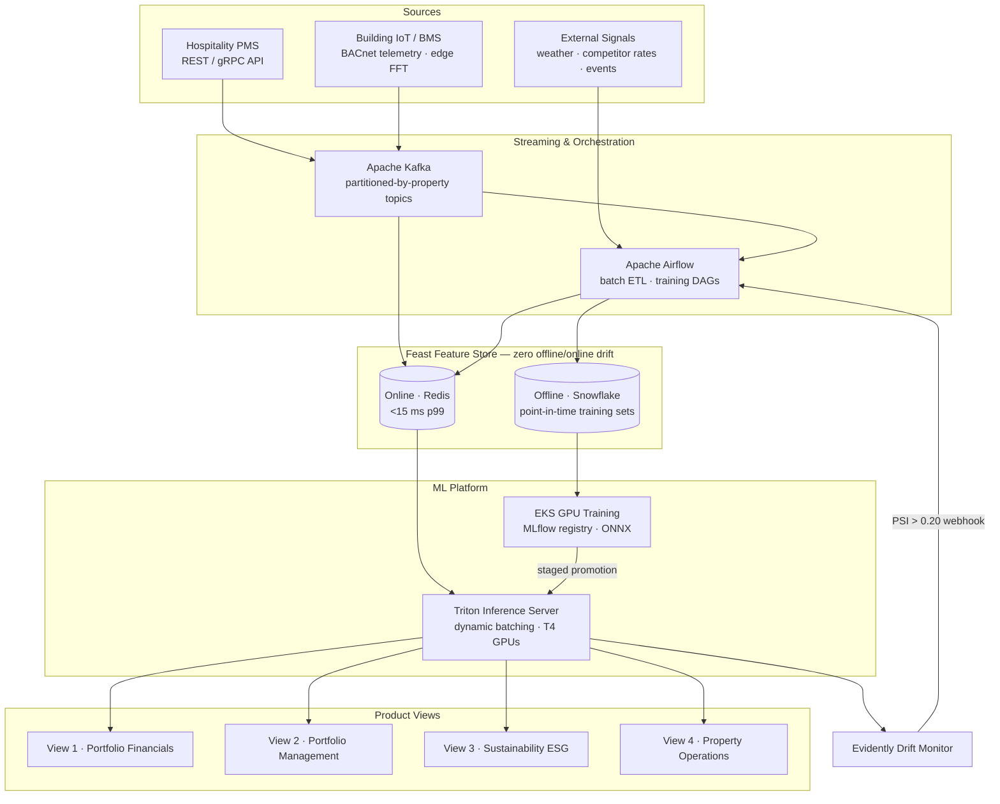
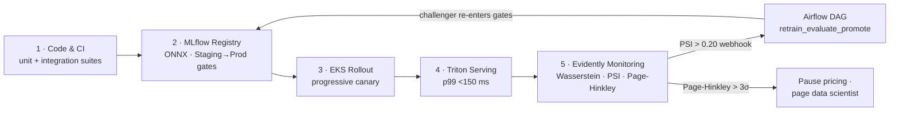

# MERIDIAN — Enterprise MLOps Platform for Hospitality Asset Intelligence

<!-- Badges: replace placeholder targets with your CI/CD and registry URLs -->
[](#)
[](#)
[](#)
[](#)
[](#)
[](#)

> **Portfolio** · [AI-infrastructure solutions-engineering hub](https://github.com/daetan999/technical_resume) · [value-engineering playbook — TCO / ROI](https://github.com/daetan999/technical_resume/blob/main/docs/value-engineering.md)

---

## Executive Summary

MERIDIAN is a production MLOps platform that replaces manual heuristics with real-time, ML-driven asset management across a global hospitality portfolio. Eight model families — demand forecasting, reinforcement-learning dynamic pricing, ESG anomaly detection, predictive maintenance, NLP ticket routing, and more — run on one shared data and serving backbone, translating model metrics directly into financial statements:

- **+$4.8M annualized profit** from a +4.2% global RevPAR lift (forecast MAPE compressed 12.5% → 4.5%)
- **−$1.8M annual utility OpEx** from LSTM-driven leak detection and HVAC load shifting (−14% utility waste)
- **+$1.5M CapEx deferred** by predicting equipment failure 14 days ahead (−42% catastrophic downtime)
- **−$240k/year cloud spend** by consolidating 100+ models onto a dynamically batched GPU cluster (−58% hosting cost)
- **85% reduction in manual model-maintenance hours** via fully automated drift-triggered retraining

---

## Data Security & Scope Disclaimer

> **Architectural Blueprint Notice:** This repository serves strictly as a sanitized, open-source structural blueprint demonstrating system design, MLOps architecture, and model engineering. The platform's internal codename, all client and property identifiers, proprietary datasets, internal endpoints, and production access tokens have been completely renamed, omitted, or mocked for security and compliance. Business impact figures are aggregated, portfolio-level modeled outcomes.

---

## Visual Architecture

### Platform Architecture — Ingest → Featurize → Train → Serve → Observe


<details>
<summary><strong>Diagram-as-code source (Mermaid)</strong></summary>



</details>

### Continuous MLOps Lifecycle — Ship → Observe → Retrain


<details>
<summary><strong>Diagram-as-code source (Mermaid)</strong></summary>



</details>

### Technical-to-Financial Transmission


---

## GPU Serving Economics — The TCO Story

The serving layer is where model architecture becomes a cloud bill. Consolidating 100+ single-tenant CPU pods (idle ~95% of the time) onto a shared, dynamically batched Triton / EKS GPU cluster is the platform's clearest FinOps win:


| Lever | Before — single-tenant CPU | After — shared batched GPU |
|---|---|---|
| Deployment | 1 CPU instance per property model | 100+ models on one T4 cluster |
| Compute utilization | ~5% (idle, bursty traffic) | **80%+** (dynamic batching) |
| Scaling cost curve | linear with property count | sub-linear — decoupled from tenant count |
| Peak headroom | over-provisioned for peak | absorbs **10×** volume spikes |
| p99 inference latency | n/a | **< 150 ms** held under load |
| **Hosting cost** | baseline | **−58% (≈ −$240K/yr)** |

Dynamic batching buffers bursty, low-QPS requests (≤ 10 ms) into dense GPU work, so **unit cost per inference falls while throughput headroom rises** — the FinOps win and the SLA win are the same architectural move. Multi-model concurrency loads and unloads property-specific models in shared GPU memory, which is what decouples property scaling from linear infrastructure cost.

Serving configuration: [`serving/`](serving/) — Triton dynamic-batching config and EKS deployment manifest. The value-based selling case built on these economics lives in the [value-engineering playbook](https://github.com/daetan999/technical_resume/blob/main/docs/value-engineering.md).

---

## The Four Product Views

| View | Models | Operational Role | Modeled Impact |
|---|---|---|---|
| **1 · Portfolio Financials** | Temporal Fusion Transformer (quantile demand forecasts) + PyTorch DQN pricing agent | Continuous rate optimization from booking velocity, competitor deltas, and demand quantiles | **+$4.8M** annualized profit (+4.2% RevPAR; RL agent contributes ≥ +3.2% yield vs static rules) |
| **2 · Portfolio Management** | t-SNE + K-Means asset clustering; Random Forest IRR feasibility | Context-aware peer benchmarking and acquisition feasibility scoring | Precision capital allocation across the global portfolio |
| **3 · Sustainability (ESG)** | Bidirectional LSTM autoencoders; SARIMAX thermal load forecasting | Leak/anomaly flagging within 30 minutes; HVAC pre-cooling around tariff windows | **−14%** utility waste · **−$1.8M** annual OpEx |
| **4 · Property Operations** | Weibull survival analysis × random forest; fine-tuned BERT ticket routing | 14-day failure prediction; instant work-order triage to on-duty engineers | **−42%** catastrophic downtime · MTTR **35 → 8 min** |

---

## Spotlight: The RL Dynamic Pricing Agent

The flagship model is a **Deep Q-Network (PyTorch)** trained with ε-greedy exploration over offline historical simulation:

- **State space `S`** — inventory velocity (On-The-Book vs capacity), Days-To-Arrival window, hourly competitor pricing delta, and TFT demand quantiles (τ ∈ {0.1, 0.5, 0.9})
- **Action space `A`** — continuous rate modifications constrained to a **bounded action space** (−15% … +35% of baseline rack rate) to prevent race-to-the-bottom feedback loops with competitor pricing algorithms
- **Reward `R`** — maximizes yield over a rolling 30-day booking window: `R = Σ (Occupancy × ADR) − Penalty(overprice-vacancy)`
- **Hard SLA** — evaluate state and return a pricing action in **< 150 ms p99**; stale prices cause booking drop-offs on external channels

Skeleton implementation: [`models/pricing_agent/dqn_pricing_agent.py`](models/pricing_agent/dqn_pricing_agent.py)

---

## Engineered Feature Families

| Feature family | Grain | Contents | Computed by |
|---|---|---|---|
| `F_Demand_Lag` | room class × property | Rolling ADR & occupancy at t−1/7/14/30 · OTB booking velocity (first derivative) | Spark SQL window functions over 90-day partitions |
| `F_Climate_Index` | property location | Cooling / Heating Degree Days vs 18 °C base | Python microservice over weather APIs |
| `F_Telemetry_Spectral` | HVAC asset | FFT magnitude bands, peak frequencies, kurtosis from raw vibration | NumPy at the edge → Kafka |

Feature definitions: [`feature_store/feature_definitions.py`](feature_store/feature_definitions.py)

---

## Reliability Engineering

**Service-level objectives**

| SLO | Target |
|---|---|
| Pricing endpoint inference latency | p99 < 150 ms |
| Feature freshness (PMS event → Redis) | < 5 min |
| Daily ETL ingestion success | > 99.9% |

**Hardened edge cases**

- **Smart-meter null-value drops** — ingestion rejects null telemetry sequences and substitutes rolling-median inputs, preventing LSTM autoencoder crashes on sensor packet loss.
- **Cold-start properties** — new acquisitions with no booking history are t-SNE-mapped to their nearest existing property cluster and bootstrapped from that cluster's pre-trained TFT weights (transfer learning), giving day-one pricing accuracy and cutting onboarding from **3 weeks to 1 hour**.
- **Drift response tiers** — feature drift (Wasserstein > 0.15) warns; target drift (PSI > 0.20) auto-retrains; concept drift (Page-Hinkley > 3σ) pauses automated pricing and pages a human.

---

## Repository Map

```
docs/                  Architecture deep-dives, model portfolio, business impact case studies
docs/assets/           Hand-built SVG architecture diagrams (render natively on GitHub)
pipelines/airflow/     Feature-engineering and drift-triggered retraining DAGs (illustrative)
feature_store/         Feast feature definitions (entity/view schemas)
models/                DQN pricing-agent skeleton · TFT hyperparameter manifest
serving/               Triton dynamic-batching config · EKS deployment manifest
monitoring/            Evidently drift thresholds and monitor service (illustrative)
```

All code in this repository is **illustrative blueprint code**: it demonstrates the interfaces, configuration shapes, and engineering conventions of the production system without any proprietary logic, data, or credentials.

---

## Deep-Dive Documentation

- [`docs/architecture.md`](docs/architecture.md) — data pipeline, feature store, and serving architecture
- [`docs/model-portfolio.md`](docs/model-portfolio.md) — per-view model specifications and mathematics
- [`docs/business-impact.md`](docs/business-impact.md) — five case studies linking model metrics to P&L

---

## License

Released under the MIT License.
